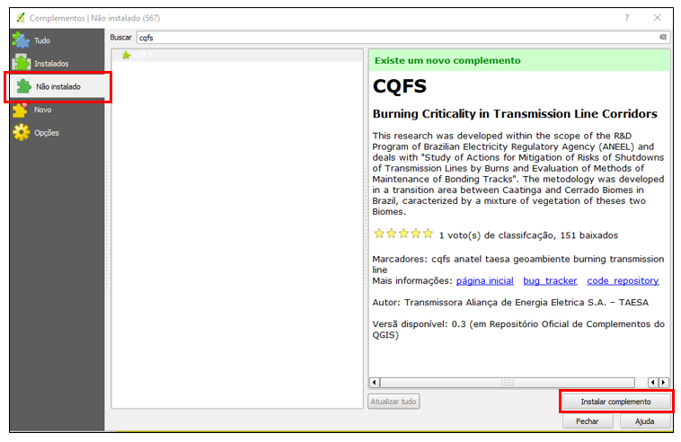

# 5     INSTRUÇÕES PARA INSTALAÇÃO DO PLUGIN CQFS

O plugin é fornecido empacotado em um arquivo .zip, e para sua instalação deve-se descompactar o arquivo no diretório:

`C:\Users\<nome do usuário>\.qgis2\python\plugins`

Caso o diretório **plugins** não exista, deve-se primeiramente criar esse diretório.

A Figura 2 mostra como deve ficar a árvore de diretórios para a instalação do plugin CQFS.

Figura 2 – Árvore de diretórios para a instalação do plugin CQFS

Após a instalação, o usuário deverá fechar e abrir novamente o QGIS. Caso a instalação tenha acontecido corretamente e o plugin tenha sido ativado, aparecerá no menu Complementos o acesso ao CQFS e na barra de ferramentas irá aparecer o ícone do plugin, conforme destacado na Figura 3.

Figura 3 – Acesso ao CQFS pelo menu do QGIS

Caso os acessos acima não tenham aparecido, será necessário a ativação do plugin. Para isso acesse a janela de Complementos (Complementos à Gerenciar e Instalar Complementos), vá até a aba Instalados, procure pelo plugin CQFS e ative o seu check-box (Figura 4).

Figura 4 – Gerenciador de complementos do QGIS

