# 6     UTILIZAÇÃO DO PLUGIN CQFS

 O plugin pode ser acessado no QGIS através do menu de Complementos (Figura 5) ou diretamente pelo ícone do plugin na barra de ferramentas (Figura 6).

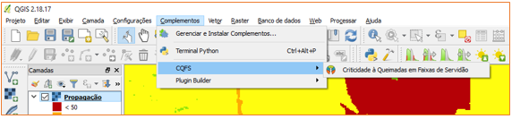

Figura 5 – Menu de acesso ao plugin

Figura 6 – Ícone de acesso ao plugin

A Figura 7 apresenta a interface principal do plugin; as ferramentas que representam cada modelo foram organizadas em abas. Assim, para acessar a ferramenta desejada o usuário deverá selecionar a aba correspondente.

Figura 7 – Interface principal CQFS

Visando a padronização dos dados de entrada e atender as restrições do QGIS e das bibliotecas espaciais utilizadas para a construção das ferramentas, foi necessária a adoção de um sistema de coordenadas único para **todos** os dados de entrada e saída. O sistema de coordenadas determinado foi Albers_SIRGAS200_Like_IBGE, os parâmetros proj4 são mostrados na Tabela 17:

Tabela 17: Parâmetros proj4 para Albers_SIRGAS200_Like_IBGE

  +proj=aea  +lat_1=-2 +lat_2=-22 +lat_0=-12 +lon_0=-54 +x_0=0 +y_0=0 +ellps=GRS80  +towgs84=0,0,0,0,0,0,0 +units=m +no_defs

**O usuário deverá utilizar dados espaciais de entradas definidos nesse sistema de coordenadas em todas as ferramentas.**

## 6.1    Utilização das Ferramentas

Para a utilização de uma ferramenta, inicialmente o usuário deverá carregar os dados de entrada do modelo (vetores e rasters) no projeto ativo do QGIS, conforme descrito no Capítulo 3. Após isso, o usuário deverá abrir o CQFS e selecionar a aba correspondente ao modelo que deseja executar, informar as camadas de entrada e saída, e pressionar o botão OK.

Caso ocorra algum erro durante a execução da ferramenta, esse erro será mostrado na parte superior do QGIS (abaixo da barra de ferramentas) e um log detalhado estará disponível no diretório “log” no diretório de instalação do plugin.

Destaca-se que a nomenclatura de pastas utilizada pelo usuário para armazenar os dados de entrada e saída não deve conter caracteres especiais (&, -, /, ~, ´, etc.) ou espaços em branco.

### *6.1.1    Ferramenta de Propagação*

A Figura 8 mostra a interface da ferramenta de **Propagação**.

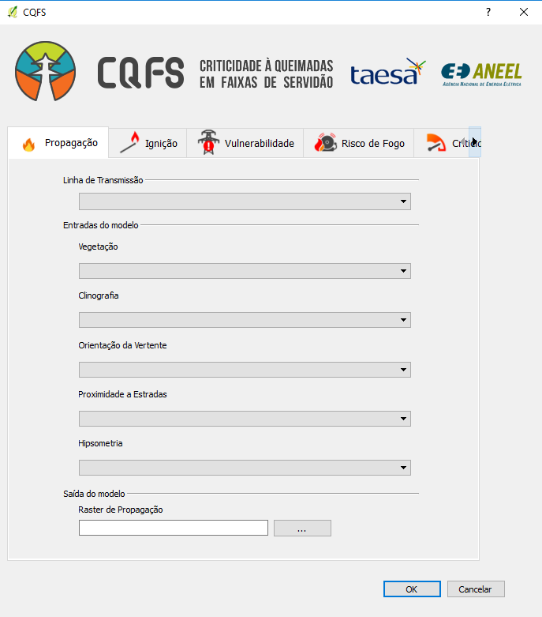

Figura 8 – Interface de Propagação

Para a execução da ferramenta o usuário deverá inicialmente adicionar no QGIS a camada vetorial da Linha de Transmissão e em seguida adicionar as seguintes camadas de rasteres:

·     Vegetação (uso do solo) (.tif);

·     Clinografia (.tif);

·     Orientação de vertente (.tif);

·     Proximidade a estradas (.tif) e

·     Hipsometria (.tif).

Após inserir todas as camadas (vetorial e raster), o usuário deve verificar uma a uma se o sistema de coordenadas está correto. Conforme citado anteriormente, o sistema de coordenadas determinado foi Albers_SIRGAS200_Like_IBGE (parâmetros proj4 são mostrados na Tabela 17). Quando alguma camada não estiver no sistema de coordenada correto, irá aparecer uma mensagem de erro na parte superior do QGIS, conforme indicado na Figura 9.

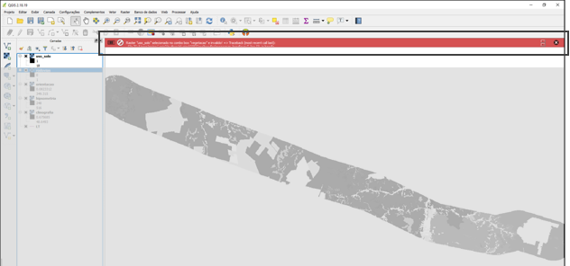

Figura 9 – Mensagem de erro quando o sistema de coordenadas não está correto.

O usuário também deverá indicar um local e arquivo no computador local para que seja salvo a camada de saída do modelo. O formato do arquivo de saída é do tipo TIFF (a nomenclatura de pastas utilizada pelo usuário para armazenar os dados de entrada e saída não deve conter caracteres especiais ou espaços em branco).

Durante a execução da ferramenta, a tela indicada na Figura 10 irá aparecer. Nesse momento, o usuário deverá verificar se o sistema de coordenadas informado está correto e clicar em ok.

Figura 10 – Tela durante o processo de execução.

Nas figuras abaixo (Figura 11 e Figura 12) demonstramos o resultado da execução da ferramenta de Propagação.

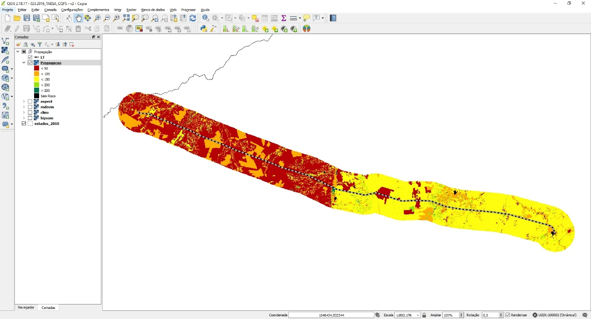

Figura 11 – Resultado da ferramenta de Propagação (1)

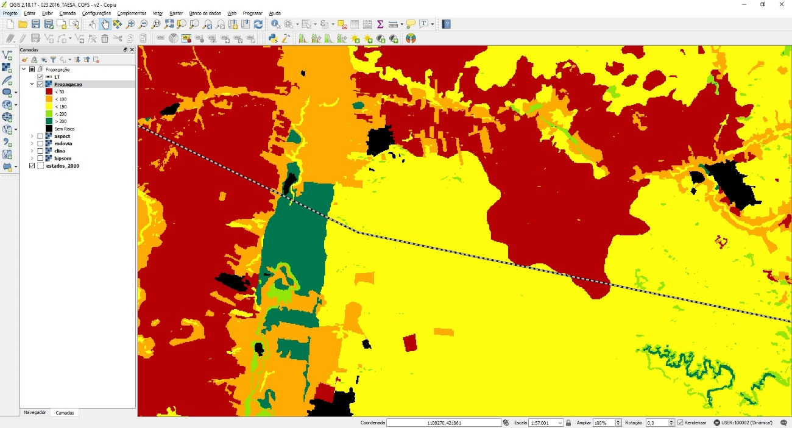

Figura 12 – Resultado da ferramenta de Propagação (2)

### *6.1.2    Ferramenta de Ignição*

 A Figura 13 e a Figura 14 mostram a interface da ferramenta de **Ignição**.

Figura 13 – Interface de Ignição – parte A

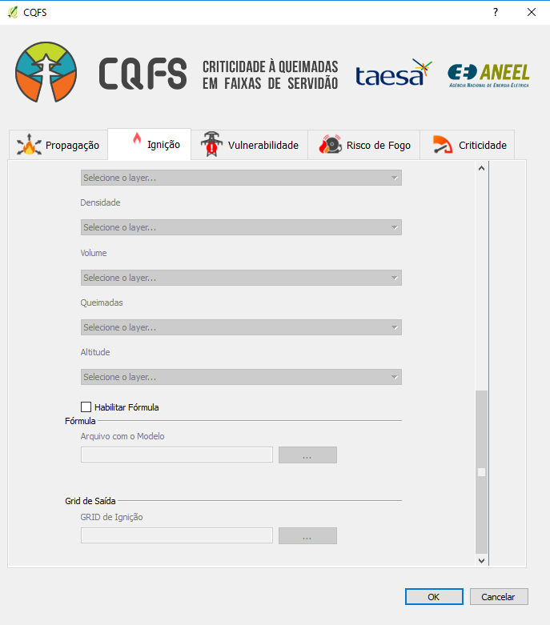

Figura 14 – Interface de Ignição – parte B

Para o usuário gerar o GRID de Ignição, ele deve selecionar a Linha de Transmissão e informar o GRID de saída (a nomenclatura de pastas utilizada pelo usuário para armazenar os dados de entrada e saída não deve conter caracteres especiais ou espaços) (Figura 15 e Figura 16). Nesse primeiro passo da ferramenta de ignição, o único vetor selecionado é a linha de transmissão indicado pelo usuário para gerar o GRID para a área de análise (Figura 17).

Figura 15 – Dado de entrada para geração de GRID (1).

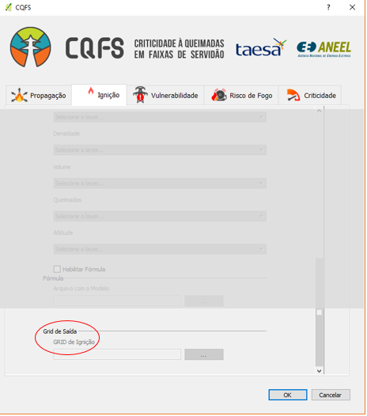

Figura 16 – Dado de saída para geração de GRID (2).

Figura 17 - GRID de ignição gerado.

Com o GRID gerado, o usuário deverá fazer o segundo passo da ferramenta de ignição, que irá preencher o GRID gerado com os dados de entrada do modelo.

Para a execução da ferramenta o usuário deverá inicialmente adicionar no QGIS as camadas vetoriais:

·     Censo (.shp);

·     Uso do solo (.shp);

·     Queimadas (.shp).

Para a execução da ferramenta o usuário deverá inicialmente adicionar no QGIS os seguintes rasteres:

·     Insolação (.tif);

·     Temperatura Máxima (.tif);

·     Velocidade Média do Vento (.tif);

·     GNDVI (.tif);

·     NDVI (.tif);

·     Área basal (.tif);

·     Densidade (.tif);

·     Volume (.tif);

·     Altitude (.tif).

Após inserir todas as camadas (vetorial e raster), o usuário deve verificar uma a uma se o sistema de coordenadas está correto. Conforme citado anteriormente, o sistema de coordenadas determinado foi Albers_SIRGAS200_Like_IBGE (parâmetros proj4 são mostrados na Tabela 17).

Para a execução a ferramenta de ignição, o usuário deve informar nesse momento o GRID de Ignição, selecionar a opção “**Habilitar Entradas”**, indicar quais as entradas que deseja preencher no GRID (Figura 18), em seguida clicar em OK.

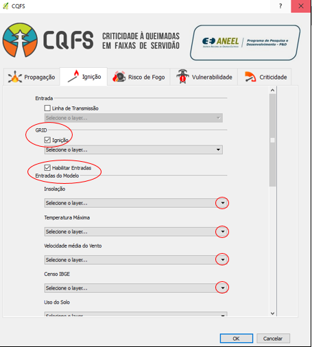

Figura 18 – Etapa para preenchimento do GRID.

Para aplicar o modelo (terceiro passo da ferramenta de ignição), o usuário deve informar novamente o GRID de Ignição, depois selecionar a opção “**Habilitar Fórmula”** e então informar o arquivo da fórmula do modelo a ser aplicada (selecionar o arquivo *weight.yaml* na pasta do CQFS) (Figura 19 e Figura 20).

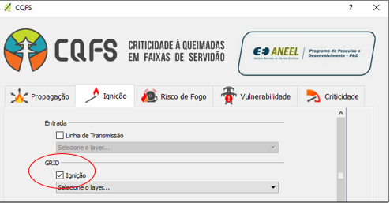

Figura 19 – Etapa para aplicação do modelo (1).

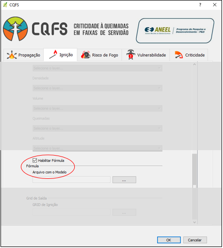

Figura 20 – Etapa para aplicação do modelo (2).

Na Figura 21 demonstramos o resultado da execução da ferramenta.

Figura 21 – Resultado da ferramenta de Ignição

### *6.1.3    Risco de Fogo*

A Figura 22 mostra a interface da ferramenta de **Risco de Fogo**.

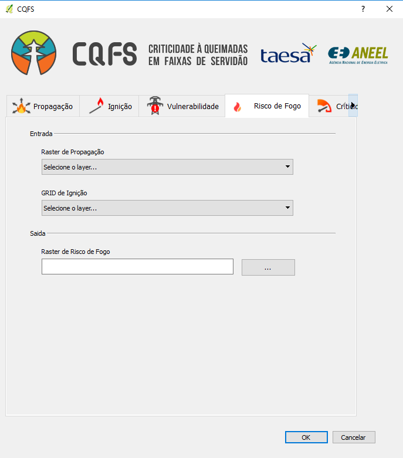

Figura 22 – Interface de Risco de Fogo

Para a execução da ferramenta o usuário deverá indicar como entradas a camada do raster de Propagação (que é a saída da ferramenta de Propagação) e o GRID de Ignição (que é a saída da ferramenta de Ignição), e como saída o diretório e arquivo no computador local do raster de Risco de Fogo (a nomenclatura de pastas utilizada pelo usuário para armazenar os dados de entrada e saída não deve conter caracteres especiais e/ou espaços em branco).

A Figura 23 é demonstrado o resultado da execução da ferramenta de Risco de Fogo.

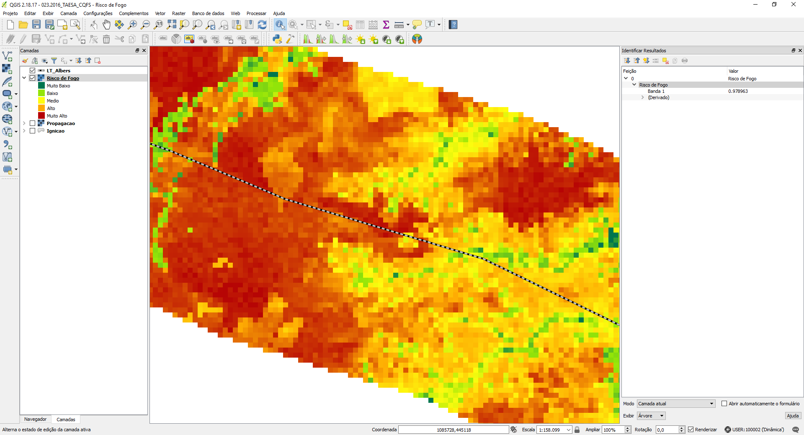

Figura 23 – Resultado da ferramenta de Risco de Fogo

### *6.1.4    Vulnerabilidade*

A Figura 24 mostra a interface da ferramenta de **Vulnerabilidade**.

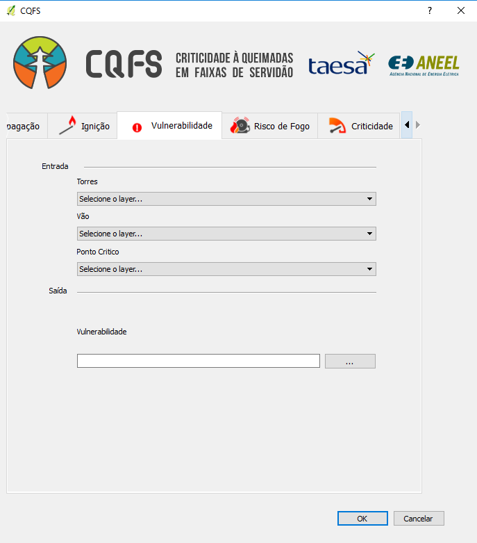

Figura 24 – Interface de Vulnerabilidade

Para a execução da ferramenta de Vulnerabilidade o usuário deverá indicar como entradas as camadas vetoriais (formato .shp) Torres, Vãos e Pontos Críticos, e como saída o shapefile de Área de Manutenção (a nomenclatura de pastas utilizada pelo usuário para armazenar os dados de entrada e saída não deve conter caracteres especiais e/ou espaços).

Essa ferramenta gera, além do resultado da vulnerabilidade, que será indicado no próprio arquivo vetorial dos vãos da linha (através da criação de um campo na tabela de atributos), uma outra camada vetorial (formato .shp) com a área de manutenção ideal para cada vão.

Após inserir todas as camadas, o usuário deve verificar uma a uma se o sistema de coordenadas está correto. Conforme citado anteriormente, o sistema de coordenadas determinado foi Albers_SIRGAS200_Like_IBGE (parâmetros proj4 são mostrados na Tabela 17).

Durante a execução da ferramenta, a tela indicada na Figura 25 irá aparecer novamente. Nesse momento, o usuário deverá verificar se o sistema de coordenadas informado está correto e clicar em ok.

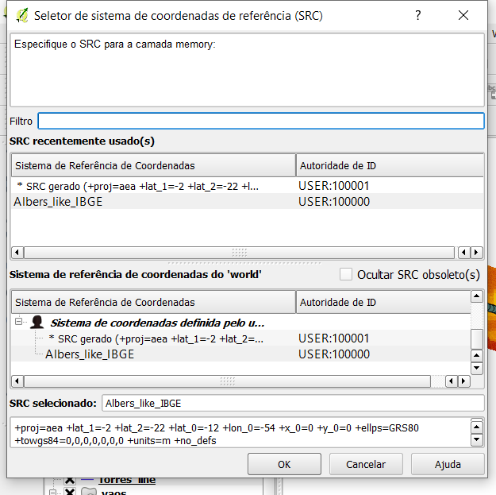

Figura 25 – Tela durante o processo de execução.

A Figura 26 está demonstrado o resultado da execução da ferramenta de Vulnerabilidade.

Figura 26 – Resultado da ferramenta de Vulnerabilidade

Conforme citado, o resultado da vulnerabilidade será indicado na própria camada vetorial de vãos da linha do usuário. A camada criada de Área de Manutenção ideal está indicada na Figura 26 como um retângulo hachurado.

Através da definição da área ideal de manutenção é possível identificar a área de maior vulnerabilidade dos vãos, amenizando os riscos de desligamentos decorrentes das queimadas.

### *6.1.5    Criticidade*

A Figura 27 mostra a interface da ferramenta de **Criticidade**.

Figura 27 – Interface de Criticidade

Para a execução da ferramenta de Criticidade o usuário deverá indicar como entradas a camada de shapefile dos vãos da linha com a classificação da Vulnerabilidade (a área de manutenção criada na ferramenta de Vulnerabilidade **não** será utilizada na Criticidade) e o raster de Risco de Fogo (que é a saída da ferramenta de Risco de Fogo), e como saída o shapefile de Criticidade (a nomenclatura de pastas utilizada pelo usuário para armazenar os dados de entrada e saída não deve conter caracteres especiais ou espaços).

Após inserir todas as camadas, o usuário deve verificar uma a uma se o sistema de coordenadas está correto. Conforme citado anteriormente, o sistema de coordenadas determinado foi Albers_SIRGAS200_Like_IBGE (parâmetros proj4 são mostrados na Tabela 17).

A Figura 28 demonstra o resultado da execução da ferramenta de **Criticidade**.

Figura 28 – Resultado da ferramenta de Criticidade

Com base na metodologia desenvolvida é possível estabelecer o grau de criticidade dos vãos da LT e também delimitar uma área ideal para a supressão da vegetação na faixa de servidão, tanto em largura quanto em extensão, e assim diminuir o risco de ocorrências de desligamentos em função de ocorrência de queimadas.

O resultado será indicado por vão da linha em Alta, Média ou Baixa Criticidade a desligamentos por queimada, considerando a escala de cores vermelho, amarelo e verde, respectivamente, conforme indicado na Figura 28.
