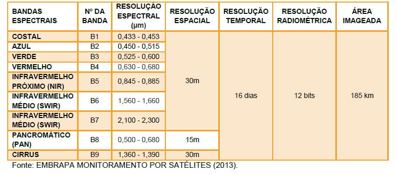
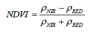
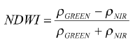
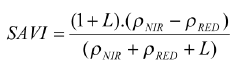

# ANEXO I - Sugestão de tratamento de dados de entrada no QGIS

**1. CENSO - IBGE - (QGIS)**

1. Baixar as informações do Censo para o Estado onde se localiza a área de análise (https://downloads.ibge.gov.br/downloads_estatisticas.htm);

Caminho: Estatísticas - Censos - Censo_Demografico_2010 - Resultados_do_Universo - Agregados_por_Setores_Censitários - escolher o estado que está localizada a área (Ex: PI_20171016.zip[[1\]](#_ftn1)).

2. Manter os campos (Domicilio01_PI.xls): 

●    V001 (quantidade de domicílios);

●    V035 (domicilio que tem coleta de lixo);

●    V038 (domicílios que queimam o lixo);

●    V039 (domicílios que enterram o lixo);

●    V043 (domicílios com disponibilidade de energia).

3. Carregar o shape dos setores censitários no QGIS;

4. Carregar a planilha no QGIS;

5. Unir os campos da tabela com o shape

1. - Propriedades da camada      --> Uniões

6.  Salvar o novo shape e reprojetar para Albers

7.  Calcular a porcentagem nos campos indicados (em relação ao total de domicílios);

1. 1. to_real (replace( "Domicili_2", 'X','0')) / to_real("Domicilio0")
   2. Nome dos campos:

​                     i.  Coleta_P;

​                    ii.  Queima_P;

​                    iii.  Enterra_P;

​                    iv.  Energia_P.

 

 **2. SRTM – 30m (QGIS).**

1. Entrar no site https://earthexplorer.usgs.gov/;

2.  Indicar área (retângulo), avaliar quais imagens recobre a área (show footprint) e fazer download da opção “GeoTIFF 1 Arc-second” (ex: s08_w045_1arc_v3.tif);

3.  Baixar as imagens e fazer o mosaico das imagens baixadas;

4.  As imagens estarão em WGS84. O usuário deverá passar o mosaico para Albers.

5.  Gerar declividade e orientação de encosta através das ferramentas *Slope* (declividade em porcentagem) e *Aspect* (*Spatial Analyst Tools*), respectivamente. 

 

**3. Landsat – reflectância de superfície (30m) (QGIS)**

1. Baixar as imagens Landsat em reflectância de superfície (https://earthexplorer.usgs.gov/) (*Tabela 18*);

 

Tabela 18 – Características do sensor OLI (Operational Land Imager) presente no satélite Landsat 8. Fonte: Embrapa monitoramento por satélite (2013).

                               

 

2. Enter Search Criteria – inserir o kml da área, avaliar quais imagens recobre a área (show footprint) e fazer download da opção (order scene) – 220/65; 219/66; 218/66. Foram utilizadas as bandas Azul (*blue*), Verde (*green*), Vermelho (*red*) e Infravermelho Próximo (*NIR*).

●    Caminho: Data sets - Landsat – Landsat Collection1 Level 2 (On-Demand) - Landsat 8 OLI/TIRS C1 Level-2;

●    Critérios adicionais – cobertura de nuvem e datas (entre agosto e outubro do ano anterior).

●    As imagens são solicitadas e demoram algumas horas para serem liberadas.

 

3.  Fazer o mosaico das imagens que recobrem a área, por banda, sem alterar qualquer parâmetro. Isso é importante para não alterar os dados;

4.  Reprojetar os mosaicos para Albers.

5.  Aplicar as equações para gerar **Área Basal, Densidade, Volume, GNDVI, NDVI (30m/Float32)**:

 

Para calcular os índices, são utilizadas as bandas do Landsat 8, da seguinte forma:

 **GNDVI:** (*Green Normalized DifferenceVegetation Index*) ou índice de vegetação por diferença normalizada verde é um índice variante do NDVI: 

   

Onde, ρNIR e ρGREEN é a reflectância das respectivas bandas do infravermelho próximo e verde respectivamente.

 

**NDVI:** (*Normalized Difference Vegetation Index*) ou índice de vegetação por diferença normalizada:

 

Onde, ρNIR e ρRED é reflectânciadas bandas do infravermelho próximo e vermelho respectivamente.

Para calcular os parâmetros de vegetação é necessário, antes de aplicar as equações, calcular os seguintes índices:

 

**NDWI** (*Normalized Difference Water Index*) ou índice de água por diferença normalizada - índice que realça limites mais distintos para detecção de áreas com presença de água:

  

Onde, ρGREEN e ρNIR é a reflectância das respectivas bandas verde e do infravermelho próximo

 

**SAVI** (Soil Adjusted Vegetation Index) ou índice de vegetação ajustado ao solo:

 

Onde, ρNIR e ρRED é a reflectância das respectivas bandas do infravermelho próximo e vermelho; e L é um fator de ajuste, que neste trabalho foi utilizado o L=0,5.

 

Os valores do NDVI variam de 1 (um) a 0 (zero), sendo mais próximo de 1 quando a planta está no ápice da sua atividade fotossintética e próximo de 0 (zero) nas etapas finais de envelhecimento foliar até a sua abcisão (queda da folha). 

 

**4. Estradas –** **DNIT.**

1. Baixar o shape file das estradas/rodovias no site do Departamento Nacional de Infraestrutura de Transportes DNIT ( http://www.dnit.gov.br/planejamento-e-pesquisa/dnit-geo - Downloads - SHP);

2.  Esse dado pode ser utilizado como apoio para o mapeamento das estradas/rodovias. Essa vetorização pode ser feita no Google Earth, ou utilizando imagens Landsat ou Sentinel 2 da área de análise. 

3.  Com o dado mapeado, fazer um buffer de 75m;

4.  Inserir o campo COD e atribuir valor 1 para todos os polígonos;

5.  Passar esse novo shape para Raster pelo COD (*Polygon to Raster*). As estradas terão valor 1 e as demais áreas terão valor 0. Cell size = 30m.

6.  Recortar o raster para a área do buffer da LT.

 

**5. Variáveis climáticas (InMET)**

1. Fazer o cadastro e entrar no Banco de dados do InMET (ESTAÇÕES E DADOS: BDMEP (DADOS HISTORICOS)) - http://www.inmet.gov.br/portal/

2.  Selecionar série histórica – dados mensais (Janeiro a Dezembro do ano anterior);

3.  Selecionar a REGIÃO desejada (N, NE, CO, SE, S); 

4.  Identificar as subestações na região da área de estudo;

5.  Pesquisar e copiar em um .txt os dados mensais de insolação, temperatura máxima média, velocidade média do vento;

6.  Os dados em .txt deverão ser abertos/salvos em .csv (Figura 29):

   

Figura 29 – Exemplo de dado de estação meteorológica

 

7. Criar um shape de pontos a partir do arquivo CSV;

8.  Reprojetar o shape para Albers;

9.  Calcular o valor médio anual de cada variável, para cada estação climatológica;

10. Baixar o plugin de interpolação;

11. Interpolar os dados das 3 variáveis utilizando IDW:

    ​	a – Método de interpolação IDW;

    ​	b – Tamanho de célula – 150m;

    ​	c – Exportar em tiff e definir o valor nodata (-9999).

12. Converter o tipo de dado para Float32

13. Verificar se o dado final está na projeção Albers.

 

**6. Pontos de queimadas (Inpe)**

1. Baixar os pontos de queimadas do ano anterior no     Portal de Monitoramento de Queimadas do Inpe (http://www.inpe.br/queimadas/portal);
2. Entrar em BDQueimadas;
3. Exportar dados;
4. Reprojetar para Albers;

5. Selecione os pontos que estão dentro da área de análise e descarte os demais (Vetor → Investigar → Selecionar pela localização);
6. Salvar a nova seleção. 

 

**7. Mapeamento de uso do solo e cobertura vegetal**

1. Elaborar o mapa de uso do solo e cobertura vegetal da área de análise, a partir de imagens Sentinel 2;

2.  Organizar a tabela de atributos conforme a Tabela 19 (manter o código pois ele é utilizado no plugin):

Tabela 19 – Legenda de uso do solo e cobertura vegetal

 

3. Reprojetar para Albers;

4.  Converter o mapa vetorial para Raster.

------

[[1\]](#_ftnref1) No exemplo, foi utilizado o arquivo do Estado do Piauí (PI)